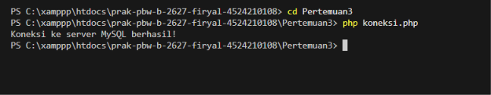
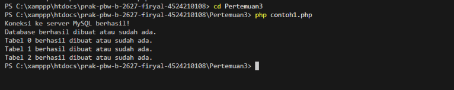
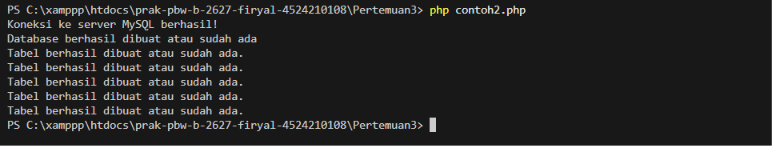
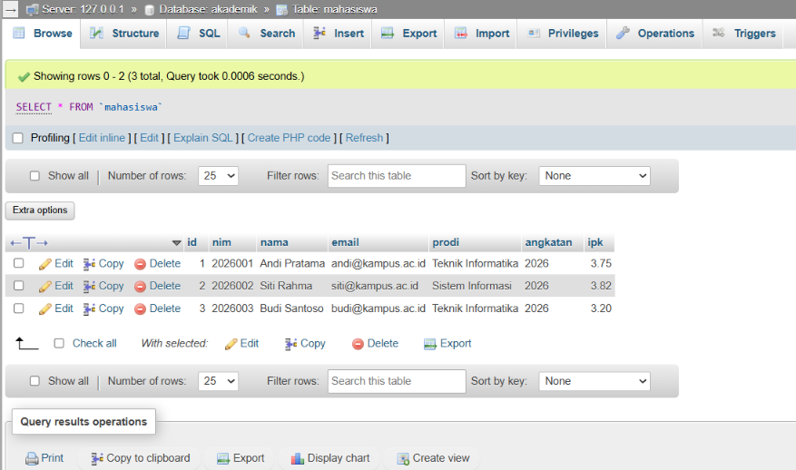
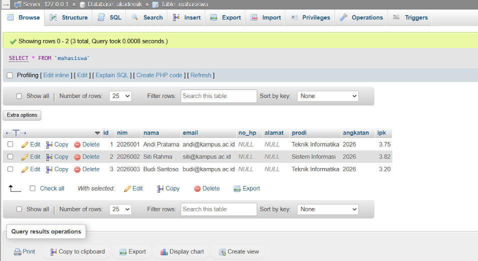

<h1 style="font-size: 18px; margin-bottom: 5px; border: none;">
LAPORAN PRAKTIKUM  
PEMROGRAMAN BERBASIS WEB
</h1>

<i>Laporan ini disusun guna memenuhi penilaian dalam mata kuliah Prak. Pemrograman Berbasis Web</i>

 

  

<b>Disusun Oleh:</b>

<b>Firyal Nibras Hariyadi</b> 
4524210108

 

<b>Dosen:</b>

Ari Wibowo, S.Kom., M.Kom., C. Pro

   

<h3 style="font-size: 16px; margin-bottom: 5px; border: none;">
S1-TEKNIK INFORMATIKA  
FAKULTAS TEKNIK UNIVERSITAS PANCASILA  
<b>2026/2027</b> 
</h3>

---

# Tugas Praktikum 3

Pada tugas ini dilakukan penerapan program pada Pertemuan 3. Program yang digunakan yaitu koneksi.php, contoh1.php, contoh2.php, dan tugas3.php. Program digunakan untuk membuat database akademik beserta tabel-tabel yang diperlukan menggunakan PHP dan MySQL.

## 1. Menjalankan Program

### A. koneksi.php

#### Hasil Running

#### Penjelasan

Program koneksi.php digunakan untuk menghubungkan PHP dengan server MySQL. Program menggunakan host `127.0.0.1`, username `root`, dan password kosong. Jika koneksi berhasil, program akan menampilkan pesan bahwa koneksi ke server MySQL berhasil.

### B. contoh1.php

#### Hasil Running

#### Penjelasan

Program contoh1.php digunakan untuk membuat database `akademik` dan beberapa tabel, yaitu tabel `mahasiswa`, `dosen`, dan `mata_kuliah`. Pada pembuatan tabel digunakan beberapa constraint seperti `PRIMARY KEY`, `AUTO_INCREMENT`, `UNIQUE`, dan `FOREIGN KEY`.

### C. contoh2.php

#### Hasil Running

#### Penjelasan

Program contoh2.php digunakan untuk melanjutkan pembuatan tabel pada database `akademik`. Pada program ini ditambahkan tabel `krs` dan `mk_krs`, serta digunakan `FOREIGN KEY` untuk menghubungkan tabel yang memiliki hubungan satu sama lain.

## 2. Modifikasi Program

### A. tugas3.php

#### Sebelum Modifikasi

#### Sesudah Modifikasi

#### Penjelasan

Modifikasi pada program tugas3.php dilakukan dengan menambahkan dua kolom baru pada tabel `mahasiswa`, yaitu `no_hp` dan `alamat`. Penambahan kolom dilakukan menggunakan perintah `ALTER TABLE` setelah proses pembuatan database dan tabel selesai.

Dua modifikasi yang dilakukan yaitu:

- `no_hp` ditambahkan dengan tipe data `VARCHAR(15)` untuk menyimpan nomor telepon mahasiswa.
- `alamat` ditambahkan dengan tipe data `VARCHAR(200)` untuk menyimpan alamat mahasiswa.

Lima bagian kode yang menurut saya penting:

- `mysqli_connect()` digunakan untuk membuat koneksi antara PHP dengan server MySQL.
- `CREATE DATABASE IF NOT EXISTS akademik` digunakan untuk membuat database `akademik` jika database tersebut belum tersedia.
- `$sqlCreateTables` digunakan untuk menyimpan perintah SQL dalam pembuatan beberapa tabel.
- `FOREIGN KEY` digunakan untuk menghubungkan tabel yang memiliki hubungan satu sama lain.
- `ALTER TABLE` digunakan untuk mengubah struktur tabel `mahasiswa` dengan menambahkan kolom `no_hp` dan `alamat`.

---