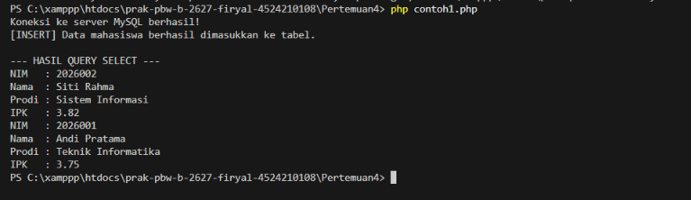
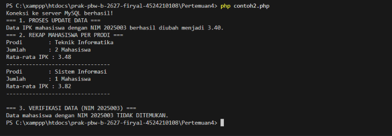

<h1 style="font-size: 18px; margin-bottom: 5px; border: none;">
LAPORAN PRAKTIKUM  
PEMROGRAMAN BERBASIS WEB
</h1>

<i>Laporan ini disusun guna memenuhi penilaian dalam mata kuliah Prak. Pemrograman Berbasis Web</i>

 

  

<b>Disusun Oleh:</b>

<b>Firyal Nibras Hariyadi</b> 
4524210108

 

<b>Dosen:</b>

Ari Wibowo, S.Kom., M.Kom., C. Pro

   

<h3 style="font-size: 16px; margin-bottom: 5px; border: none;">
S1-TEKNIK INFORMATIKA  
FAKULTAS TEKNIK UNIVERSITAS PANCASILA  
<b>2026/2027</b> 
</h3>

---

# Tugas Praktikum 4

Pada tugas ini dilakukan penerapan program pada Pertemuan 4. Program yang digunakan yaitu `koneksi.php`, `contoh1.php`, `contoh2.php`, `tugas4-1.php`, dan `tugas4-2.php`. Program digunakan untuk melakukan proses pengolahan data mahasiswa menggunakan PHP dan MySQL.

## 1. Menjalankan Program

### A. koneksi.php

#### Hasil Running

#### Penjelasan

Program `koneksi.php` digunakan untuk menghubungkan PHP dengan server MySQL. Program menggunakan host `127.0.0.1`, username `root`, dan password kosong. Jika koneksi berhasil, program akan menampilkan pesan bahwa koneksi ke server MySQL berhasil.

### B. contoh1.php

#### Hasil Running

#### Penjelasan

Program `contoh1.php` digunakan untuk memasukkan data mahasiswa ke dalam tabel `mahasiswa` menggunakan perintah `INSERT`. Setelah data dimasukkan, program menggunakan perintah `SELECT` untuk menampilkan data mahasiswa dengan IPK minimal 3.50. Data kemudian diurutkan berdasarkan IPK dari yang tertinggi dan nama secara alfabetis.

### C. contoh2.php

#### Hasil Running

#### Penjelasan

Program `contoh2.php` digunakan untuk melakukan beberapa proses pengolahan data mahasiswa, yaitu `UPDATE`, `SELECT`, `GROUP BY`, dan `DELETE`. Program mengubah IPK mahasiswa berdasarkan NIM, menampilkan rekap jumlah mahasiswa dan rata-rata IPK berdasarkan program studi, melakukan verifikasi data sebelum penghapusan, kemudian menghapus data mahasiswa yang ditentukan.

## 2. Modifikasi Program

### A. tugas4-1.php

Modifikasi pada program `tugas4-1.php` dilakukan dengan menambahkan dua query baru setelah proses `SELECT` utama. Modifikasi ini digunakan untuk menampilkan data mahasiswa berdasarkan program studi dan mencari mahasiswa dengan IPK tertinggi.

Dua modifikasi yang dilakukan yaitu:

- Menambahkan query untuk menampilkan mahasiswa yang berasal dari program studi `Teknik Informatika`, sehingga data yang ditampilkan hanya mahasiswa dari program studi tersebut.

- Menambahkan query untuk menampilkan mahasiswa dengan IPK tertinggi menggunakan pengurutan IPK secara menurun dan `LIMIT 1`.

### B. tugas4-2.php

Modifikasi pada program `tugas4-2.php` dilakukan dengan menambahkan dua query baru setelah proses `UPDATE`, rekap data, verifikasi, dan `DELETE`. Modifikasi ini digunakan untuk menampilkan mahasiswa berdasarkan nilai IPK dan menghitung jumlah mahasiswa yang terdapat di dalam tabel.

Dua modifikasi yang dilakukan yaitu:

- Menambahkan query untuk menampilkan mahasiswa yang memiliki IPK di atas 3.50 menggunakan kondisi `WHERE ipk > 3.50`.

- Menambahkan query `COUNT(*)` untuk menghitung jumlah seluruh mahasiswa yang terdapat pada tabel `mahasiswa`.

Lima bagian kode yang menurut saya penting:

- `INSERT INTO mahasiswa` digunakan untuk memasukkan data mahasiswa ke dalam tabel `mahasiswa`.

- `SELECT` digunakan untuk mengambil dan menampilkan data mahasiswa sesuai dengan kondisi yang ditentukan.

- `UPDATE mahasiswa SET ipk = 3.40` digunakan untuk mengubah nilai IPK mahasiswa berdasarkan NIM.

- `GROUP BY prodi` digunakan untuk mengelompokkan data mahasiswa berdasarkan program studi sehingga dapat dibuat rekap jumlah mahasiswa dan rata-rata IPK.

- `DELETE FROM mahasiswa` digunakan untuk menghapus data mahasiswa berdasarkan NIM yang telah ditentukan.

---