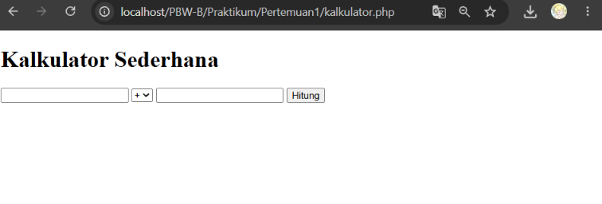
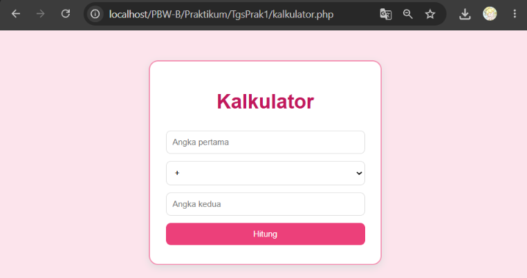
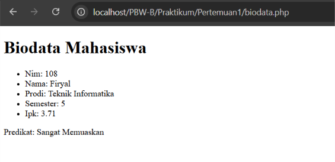
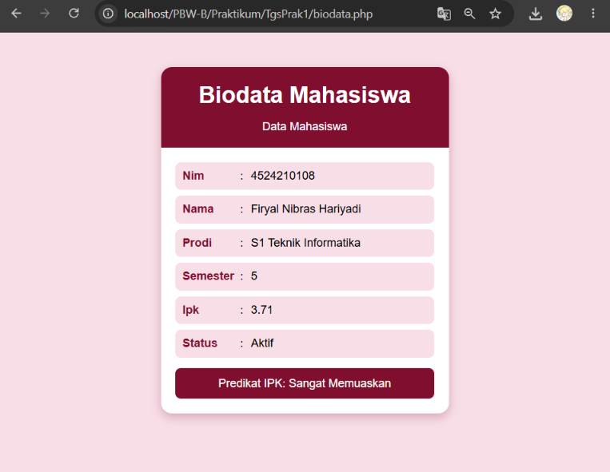

<h1 style="font-size: 18px; margin-bottom: 5px; border: none;">
LAPORAN PRAKTIKUM  
PEMROGRAMAN BERBASIS WEB
</h1>

<i>"Laporan ini disusun guna memenuhi penilaian dalam mata kuliah Prak. Pemrograman Berbasis Web"</i>

 

  

<b>Disusun Oleh:</b>

<b>Firyal Nibras Hariyadi</b> 
4524210108

 

<b>Dosen:</b>

Ari Wibowo, S.Kom., M.Kom., C. Pro

   

<h3 style="font-size: 16px; margin-bottom: 5px; border: none;">
S1-TEKNIK INFORMATIKA  
FAKULTAS TEKNIK UNIVERSITAS PANCASILA  
<b>2026/2027</b> 
</h3>

---

# Tugas Praktikum 1

Pada tugas ini dilakukan modifikasi terhadap program pada Pertemuan 1. Program yang digunakan yaitu kalkulator.php dan biodata.php.

## 1. Modifikasi Program

### A. kalkulator.php

#### Sebelum Modifikasi

#### Sesudah Modifikasi

#### Penjelasan

Modifikasi pada program kalkulator.php dilakukan terutama pada tampilan dan penyajian hasil. Pada versi awal, tampilan masih menggunakan HTML sederhana, sedangkan setelah modifikasi ditambahkan CSS berupa background, card, border, border-radius, shadow, dan pengaturan warna agar tampilan lebih rapi. Input juga diberi placeholder “Angka pertama” dan “Angka kedua”, sedangkan hasil atau pesan ditampilkan menggunakan div class="hasil".

Lima bagian kode yang menurut saya penting:

- `$_POST` digunakan untuk mengambil data angka dan operator yang dimasukkan melalui form.
- `switch ($operator)` digunakan untuk menentukan operasi perhitungan berdasarkan operator yang dipilih.
- `if ($b == 0)` digunakan untuk menangani kondisi ketika pengguna melakukan pembagian dengan nol.
- `.card` digunakan untuk mengatur tampilan utama kalkulator agar berbentuk card yang lebih rapi.
- `.hasil` digunakan untuk mengatur tampilan hasil perhitungan atau pesan yang muncul setelah proses dilakukan.

### B. biodata.php

#### Sebelum Modifikasi

#### Sesudah Modifikasi

#### Penjelasan

Modifikasi pada program biodata.php dilakukan pada data mahasiswa dan tampilan halaman. Data NIM diubah menjadi 4524210108, nama menjadi Firyal Nibras Hariyadi, dan program studi menjadi S1 Teknik Informatika. Selain itu, ditambahkan field status dengan nilai Aktif pada array mahasiswa. Tampilan yang sebelumnya berupa daftar sederhana diubah menjadi card dengan bagian header dan content menggunakan CSS.

Lima bagian kode yang menurut saya penting:

- Array `$mahasiswa` digunakan untuk menyimpan seluruh data mahasiswa.
- Field `status` ditambahkan untuk melengkapi informasi mahasiswa dengan status Aktif.
- Function `statusKelulusan()` digunakan untuk menentukan predikat berdasarkan nilai IPK.
- `foreach` digunakan untuk menampilkan seluruh data mahasiswa secara otomatis.
- Class `.data` digunakan untuk mengatur tampilan setiap data mahasiswa agar lebih rapi.

---

