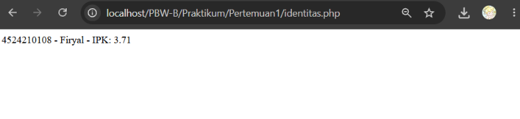
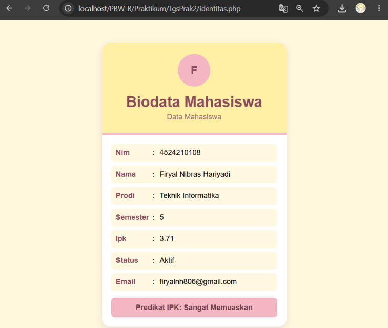
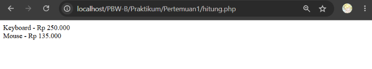
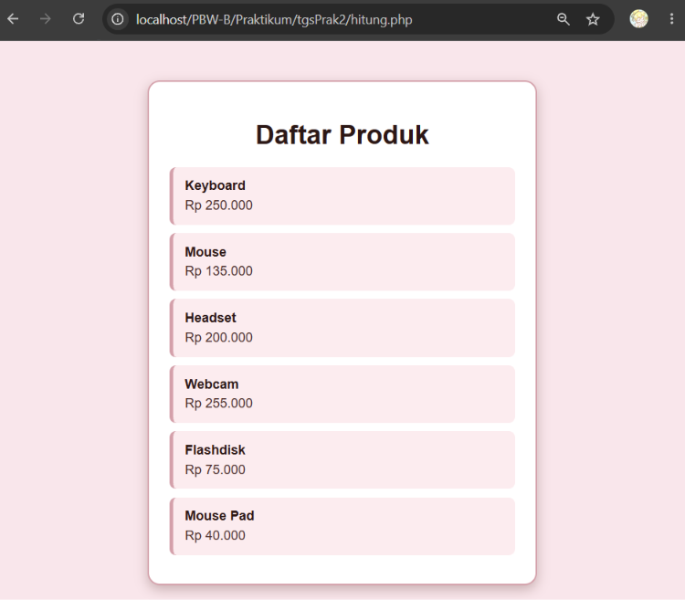

<h1 style="font-size: 18px; margin-bottom: 5px; border: none;">
LAPORAN PRAKTIKUM  
PEMROGRAMAN BERBASIS WEB
</h1>

<i>Laporan ini disusun guna memenuhi penilaian dalam mata kuliah Prak. Pemrograman Berbasis Web</i>

 

  

<b>Disusun Oleh:</b>

<b>Firyal Nibras Hariyadi</b> 
4524210108

 

<b>Dosen:</b>

Ari Wibowo, S.Kom., M.Kom., C. Pro

   

<h3 style="font-size: 16px; margin-bottom: 5px; border: none;">
S1-TEKNIK INFORMATIKA  
FAKULTAS TEKNIK UNIVERSITAS PANCASILA  
<b>2026/2027</b> 
</h3>

---

# Tugas Praktikum 2

Pada tugas ini dilakukan modifikasi terhadap program pada Pertemuan 2. Program yang digunakan yaitu identitas.php dan hitung.php.

## 1. Modifikasi Program

### A. identitas.php

#### Sebelum Modifikasi

#### Sesudah Modifikasi

#### Penjelasan

Modifikasi pada program identitas.php dilakukan dengan mengubah tampilan program yang sebelumnya hanya menampilkan ringkasan mahasiswa menjadi halaman biodata yang lebih lengkap dan rapi. Data mahasiswa juga dilengkapi dengan nama lengkap, program studi, semester, status, dan email. Selain itu, ditambahkan tampilan card, header, serta icon inisial nama menggunakan CSS.

Lima bagian kode yang menurut saya penting:

- Function `statusKelulusan()` digunakan untuk menentukan predikat mahasiswa berdasarkan nilai IPK.
- Array `$mahasiswa` digunakan untuk menyimpan berbagai data mahasiswa seperti NIM, nama, program studi, semester, IPK, status, dan email.
- Field `status` dan `email` ditambahkan untuk melengkapi informasi biodata mahasiswa.
- `foreach` digunakan untuk menampilkan seluruh data yang terdapat dalam array `$mahasiswa` secara otomatis.
- Class `.card` digunakan untuk membuat tampilan biodata dalam bentuk card agar lebih rapi dan terstruktur.

### B. hitung.php

#### Sebelum Modifikasi

#### Sesudah Modifikasi

#### Penjelasan

Modifikasi pada program hitung.php dilakukan dengan menambahkan beberapa produk baru ke dalam daftar serta mengubah tampilan hasil menjadi halaman daftar produk yang lebih rapi. Produk yang ditambahkan yaitu Headset, Webcam, Flashdisk, dan Mouse Pad dengan beberapa produk memiliki diskon. Selain itu, ditambahkan CSS berupa card, background, border, dan pengaturan tampilan setiap produk.

Lima bagian kode yang menurut saya penting:

- Interface `BisaDihitung` digunakan sebagai aturan bahwa setiap produk harus memiliki method `hargaAkhir()`.
- Class `Produk` digunakan untuk menyimpan nama dan harga produk serta menentukan harga akhir produk tanpa diskon.
- Class `ProdukDiskon` merupakan turunan dari `Produk` yang digunakan untuk menghitung harga produk setelah mendapatkan diskon.
- Array `$daftar` digunakan untuk menyimpan seluruh produk yang ditampilkan, termasuk produk biasa dan produk diskon.
- `foreach` digunakan untuk menampilkan setiap produk beserta harga akhirnya secara otomatis pada halaman.
